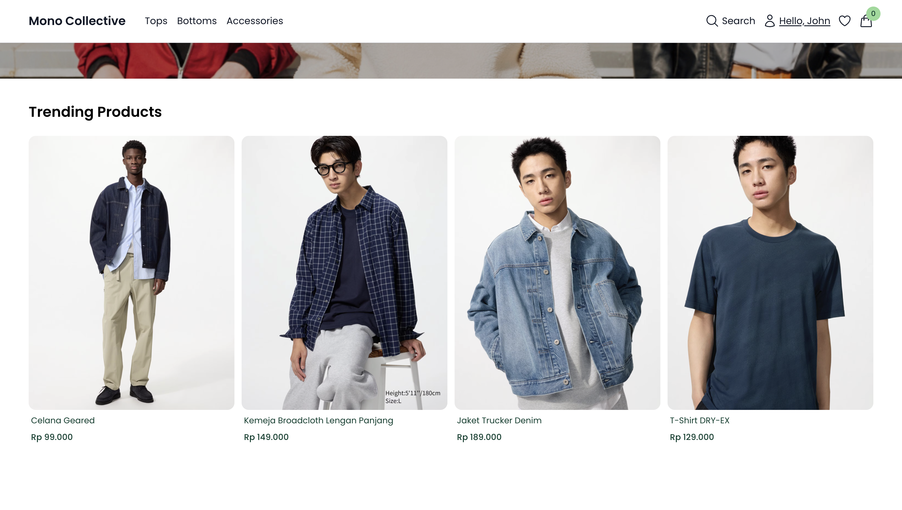
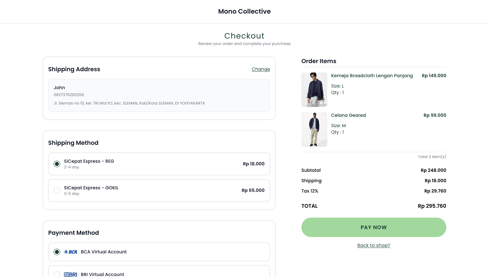
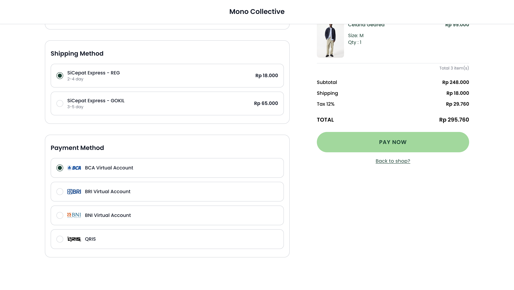
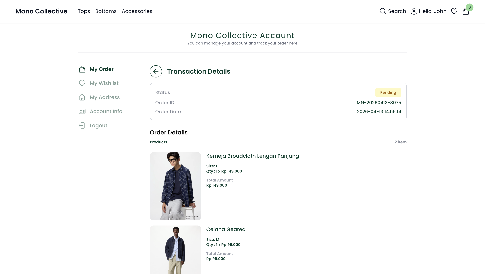
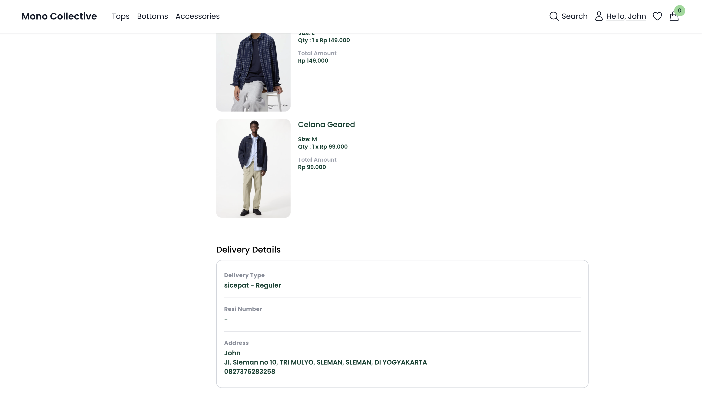
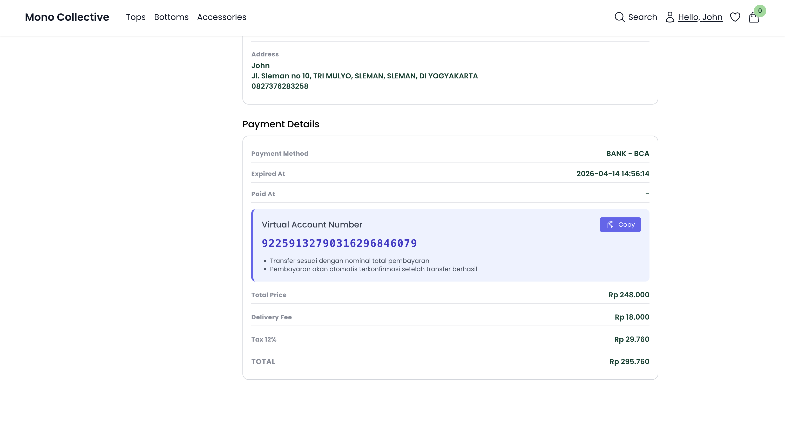

# Mono Collective E-Commerce

Web e-commerce yang dibuat menggunakan laravel 12, halaman admin menggunakan filament, halaman client menggunakan inertia react, untuk menghitung biaya pengiriman menggunakan rajaongkir dan untuk pembayaran menggunakan midtrans. Tujuan portfolio ini adalah untuk belajar dan terbiasa penggunaan filament dan untuk pembayarannya kali ini menggunakan core api midtrans jadinya lebih profesional.

## Preview Aplikasi

### Disclaimer

Gambar produk yang digunakan dalam project ini hanya untuk keperluan demo dan bukan milik saya.

## Tech Stack

- Backend: Laravel
- Frontend: React (InertiaJS)
- Database: Mysql
- Role & Permission: Spatie
- Payment Gateway: Midtrans
- Shipping: Rajaongkir
- Admin Panel: Filament
- Authentication: Breeze

## Fitur Utama

- Login & register user
- Role dan permission (admin/customer)
- Keranjang belanja
- Search produk
- Checkout dan pembayaran online
- Hitung ongkir otomatis
- Manajemen pesanan
- Dashboard admin

## Halaman admin:

- Dashboard
- CRUD data user dan admin
- CRUD data roles
- CRUD data kategori
- CRUD data produk, size dan foto produk
- Edit data order

## Halaman client/customer:

- Auth login dan register
- Halaman account info
- Halaman my order
- Halaman order detail
- Halaman my wishlist
- Halaman My Address
- Halaman Home
- Menampilkan Produk berdasarkan kategori yang dipilih
- Search produk
- Produk Detail
- Drawer cart
- Halaman Checkout
